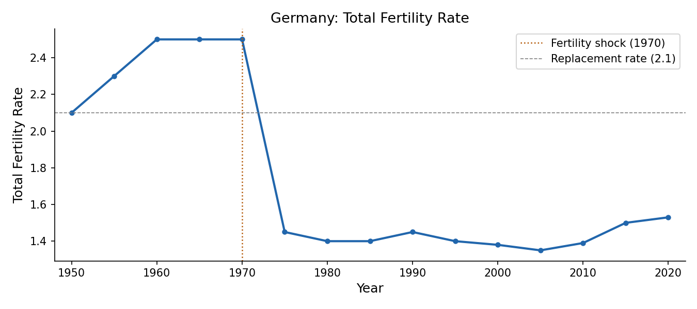
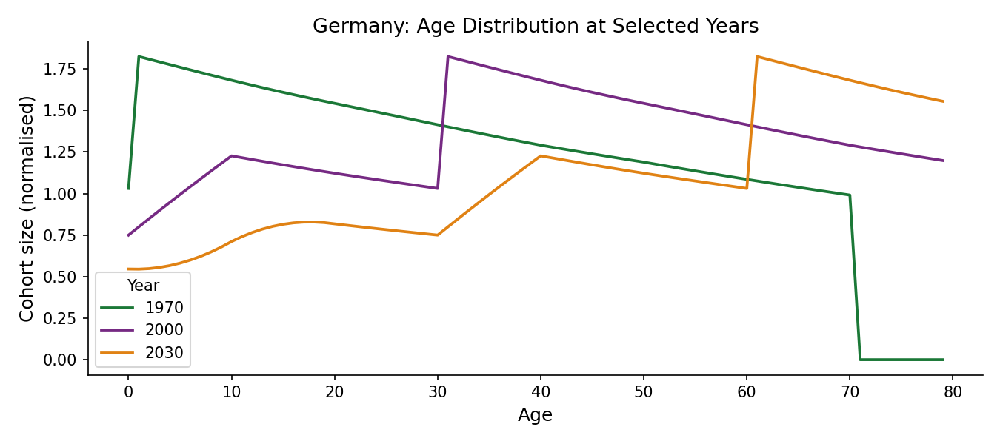
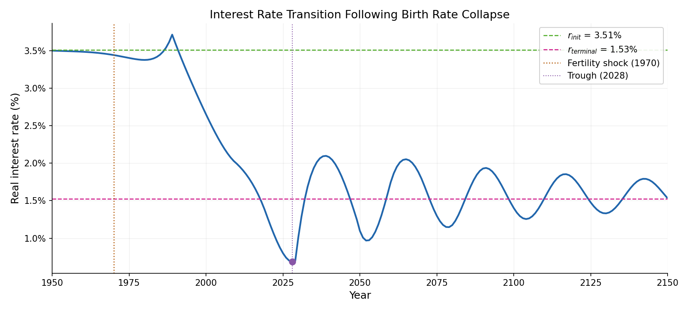
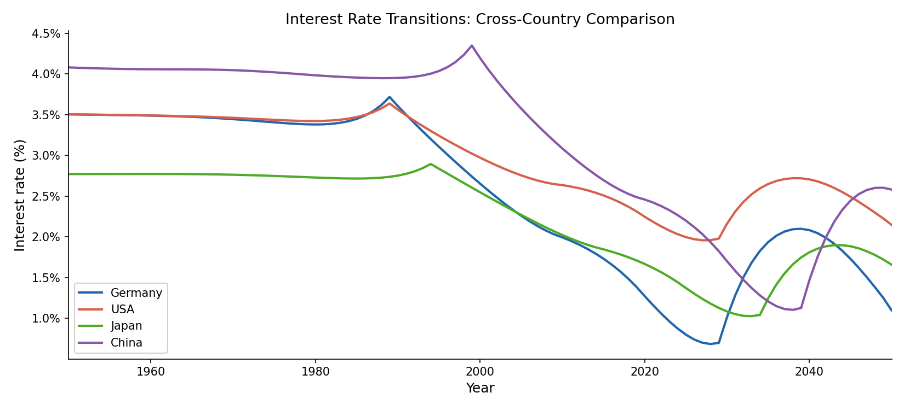

## Introduction

Real interest rates have fallen roughly four percentage points since the mid-1980s. We show that the collapse in birth rates around 1970 accounts for a significant share of this decline: the baby boomers — the last large birth cohort — accumulate savings ahead of retirement, driving down interest rates to a trough near zero around 2028, overshooting the new long-run equilibrium, itself lower due to negative population growth. We use a large OLG model with CES production calibrated to Germany, and show that the same demographic mechanism, fed with observed fertility profiles, generates qualitatively similar transitions for the US, Japan, and China. Relative to Lu and Teulings (2015), this replication omits the land extension and the bequest motive.

## Demographic Transition

### The Fertility Shock

The total fertility rate in Germany fell from approximately 2.5 in 1965 to below 1.5 by the mid-1970s, with similar falls in other advanced economies and China.

{fig-align="center" width="80%"}

### Cohort Size Dynamics

Cohort sizes evolve according to

$$N_t = b_t \sum_{i=F}^{\bar{F}-1} N_{t-1-i},$$

where $b_t$ is the period fertility rate and the sum runs over women of fertile age $[F, \bar{F})$. Because the mothers of post-1970 cohorts were themselves born during the high-fertility era, the pre-shock generation is considerably larger than those that follow, creating a hump in the age distribution that reaches prime saving ages in the 2000s–2010s.

{fig-align="center" width="80%"}

## The OLG Model

### Households

Households maximise CRRA lifetime utility

$$U_\tau = \sum_{i=\chi}^{J-1} \beta^i \frac{c_{\tau,i}^{1-\theta}}{1-\theta},$$

where $\beta$ is the discount factor and $\theta$ the inverse elasticity of intertemporal substitution. The Euler equation

$$c_{\tau,i+1} = \beta^{1/\theta}(1+r_{\tau+i+1})^{1/\theta}\, c_{\tau,i}$$

links consumption growth to the real interest rate. Assets accumulate as

$$a_{\tau,i+1} = (1+r_{\tau+i})\,a_{\tau,i} + w_{\tau+i}\,\ell_i - c_{\tau,i},$$

with $\ell_i = 1$ during working years $[\chi, \psi)$ and zero thereafter.

### Firms

Output is produced via CES technology

$$Y_t = \left[\alpha K_t^{\frac{\sigma-1}{\sigma}} + (1-\alpha)L_t^{\frac{\sigma-1}{\sigma}}\right]^{\frac{\sigma}{\sigma-1}},$$

where $\sigma < 1$ implies capital and labour are gross complements. Factor prices equal marginal products:

$$r_t = \alpha \left(\frac{Y_t}{K_t}\right)^{1/\sigma}, \qquad w_t = (1-\alpha)\left(\frac{Y_t}{L_t}\right)^{1/\sigma}.$$

### Equilibrium and Calibration

Market clearing requires $\sum_{\tau} N_\tau a_{\tau,t} = K_t$ in every period. We solve for the transition path by iterating over interest-rate and wage sequences until this condition holds, starting from the pre-shock balanced growth path. The discount factor $\beta$ is calibrated to match an initial real interest rate of 3.5 percent; remaining parameters follow standard values from the literature.

| Parameter | Value | Description |
|-----------|-------|-------------|
| $\alpha$ | 0.33 | Capital share |
| $\sigma$ | 0.4 | Elasticity of substitution |
| $\delta$ | 0.05 | Depreciation rate |
| $\beta$ | 0.946 | Discount factor (calibrated to $r_\text{init} = 3.5\%$) |
| $\theta$ | 2.0 | Inverse EIS |
| $\gamma$ | 0.015 | TFP growth rate |
| $J$ | 80 | Lifespan (periods) |
| $\chi$ | 20 | Age entering labour market |
| $\psi$ | 60 | Retirement age |

## Results

### Germany Baseline

Starting from 3.5 percent in the early 1980s, the model-implied rate falls to near zero by 2028 — a peak-to-trough decline of roughly three percentage points — before recovering to a new balanced-growth-path level of approximately 1.5 percent. The brief overshoot below the new equilibrium reflects the lag between peak saving pressure and the onset of dissaving by the large pre-shock cohort.

{fig-align="center" width="80%"}

### Cross-Country Comparison

Countries with an earlier or sharper fertility decline exhibit an earlier or deeper trough: Japan leads by approximately five years, while the United States shows a shallower path. All cross-country differences are captured using only country-specific cohort-size data and a common structural parameterisation.

{fig-align="center" width="80%"}

## Conclusion

The post-1970 fertility collapse accounts for approximately three percentage points of the observed decline in real interest rates across advanced economies, with a trough near zero around 2028. After that point, the gradual exit of the large pre-shock cohort from the saving pool allows rates to recover toward a new, lower balanced-growth-path level. The current era of depressed rates is therefore partly transitional, and policy frameworks premised on their permanence may require revision.

## References

Samuelson, P. A. (1958). An exact consumption-loan model of interest with or without the social contrivance of money. *Journal of Political Economy*, 66(6), 467–482.

Rachel, L. and Smith, T. (2015). Secular drivers of the global real interest rate. Bank of England Working Paper No. 571.

Carvalho, C., Ferrero, A. and Nechio, F. (2016). Demographics and real interest rates: Inspecting the mechanism. *European Economic Review*, 88, 208–226.

Lu, J. and Teulings, C. (2015). Fertility Rates and the Age Distribution. University of Cambridge Working Paper. First version: September 2015, last edited: October 2017.
